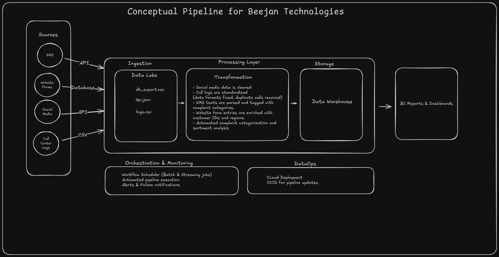

# Beejan Technologies - Customer Complaint Data Pipeline

**Name:** Oshundiya Oluwapelumi  
**Role:** Core Data Engineer

---

## Introduction

At Beejan Technologies, customer complaints come through multiple channels (SMS, call center logs, social media, website forms) but data is scattered in different formats. The reporting team manually compiles insights, slowing down decision-making. We need an end-to-end pipeline to consolidate, clean, and prepare this data for analytics.

---

## Design Choices

### Source Identification & Ingestion

- **Social Media (Real-time API):** Streamed in real-time for immediate reputation management. When customers post negative reviews publicly, we can respond within minutes to resolve issues and protect brand image.
- **Call Logs (Daily Batch CSV):** Collected daily via file uploads. No immediate response needed, but provides insights on call frequency, common issues, and resolution times.
- **SMS (Hourly API):** Near real-time collection ensures same-day response while allowing efficient batch processing for keyword analysis and smart routing.
- **Website Forms (Hourly Database):** Extracted hourly from connected database. Lower urgency but maintains timely customer service response.

### Processing & Transformation

Data flows through a three-step transformation:

1. **Cleaning:** Remove duplicates, standardize formats, filter invalid entries.
2. **Enrichment:** Add sentiment analysis, complaint categorization, customer profile matching.
3. **Standardization:** Create unified schema across all sources for consistent analysis.

### Storage

- **Data Lake:** Stores raw data (e.g., `db_export.csv`, `api.json`, `logs.csv`) for lineage and flexibility.
- **Data Warehouse:** Holds cleaned, structured data optimized for fast querying and reporting.

---

## Assumptions

- **Volume:** 5,000–15,000 daily complaints across all channels.
- **Response Time:** Social media requires sub-minute processing; others can handle hourly batches.
- **Retention:** Years of data for compliance and trend analysis.
- **Infrastructure:** Cloud deployment for scalability.
- **Team:** Current staff can be trained on new pipeline operations.

---

## Challenges & Unknowns

Handling unstructured text complaints consistently.

Real-time categorization at scale.

Integration with legacy systems.

Ensuring data privacy and compliance.

---

## Conclusion

This pipeline transforms scattered complaint data into actionable insights, enabling data-driven customer service excellence at Beejan Technologies. By consolidating diverse data sources, cleaning and enriching them, and providing fast access to insights, the company can improve customer satisfaction, protect its brand, and make smarter business decisions.
